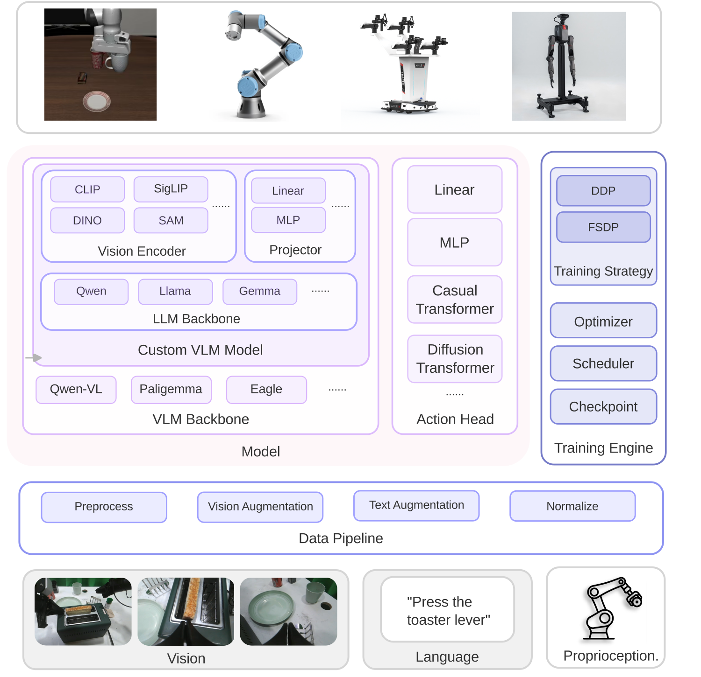

# FluxVLA Engine

<p align="center">
  
</p>

A Unified, Modular, and Deployable VLA Codebase.

## Framework

<p align="center">
  
</p>

## Installation

The following installation guide uses NVCC 12.4 as an example. Please adjust the CUDA version accordingly if your setup differs.

### 1. Create conda environment

```bash
conda create -n fluxvla python=3.10 -y
conda activate fluxvla
```

### 2. Install PyTorch (CUDA version)

> **Important**: PyTorch **must** be installed from the official CUDA index **before** running `pip install -r requirements.txt`. The CUDA-enabled build cannot be obtained from the default PyPI index.

```bash
pip install torch==2.6.0 torchvision==0.21.0 torchaudio==2.6.0 --index-url https://download.pytorch.org/whl/cu124
```

For other CUDA versions, replace `cu124` accordingly (e.g., `cu118`, `cu121`). See https://pytorch.org/get-started/locally/ for details.

### 3. Install flash-attention

Option 1: Install directly via pip:

```bash
pip install psutil ninja packaging
# MAX_JOBS controls the number of parallel compilation threads; adjust based on your machine's resources
MAX_JOBS=8 pip install flash-attn==2.5.5 --no-build-isolation --find-links https://github.com/Dao-AILab/flash-attention/releases
```

Option 2: Build from source (recommended if Option 1 fails):

```bash
git clone https://github.com/Dao-AILab/flash-attention.git
cd flash-attention
git checkout v2.5.5
# MAX_JOBS controls the number of parallel compilation threads; adjust based on your machine's resources
MAX_JOBS=8 python setup.py install
```

### 4. Install av

```bash
conda install -c conda-forge av=14.4.0
```

### 5. Install fluxvla and remaining dependencies

```bash
pip install -r requirements.txt
pip install --no-build-isolation -e .
```

> **Note**: `requirements.txt` pins `torch==2.6.0` to prevent pip from accidentally replacing the CUDA-enabled PyTorch installed in Step 2. If you need a different torch version, update both the Step 2 command and the version in `requirements.txt`.

### Online Evaluation Environment Setup

To evaluate LIBERO on devices without ray tracing support (such as A100), please refer to [EGL Device GPU Rendering Configuration](https://github.com/google-deepmind/mujoco/issues/572#issuecomment-2419965230).

### Install Dependencies

```bash
export MUJOCO_GL=egl
sudo apt install libegl-dev libgl1-mesa-dev libx11-dev libglew-dev libosmesa6-dev
```

#### Environment Check

Verify that `/proc/1/environ` contains the following environment variables:

- `NVIDIA_DRIVER_CAPABILITIES=all`
- `NVARCH=x86_64`
- `NVIDIA_REQUIRE_CUDA=cuda>=12.4`
- `brand=tesla` and `driver>=470`

#### Create EGL Configuration File

Create the file `/usr/share/glvnd/egl_vendor.d/10_nvidia.json` with the following content:

```json
{
    "file_format_version": "1.0.0",
    "ICD": {
        "library_path": "libEGL_nvidia.so.0"
    }
}
```

### Setup pre-commit hooks (Optional but Recommended)

To ensure code quality and consistency, especially for C++/CUDA code, install pre-commit hooks:

```bash
pip install pre-commit
pre-commit install
```

This will automatically check and format your code before each commit.

### Configure Weights & Biases (wandb)

[Weights & Biases](https://wandb.ai/) is used for experiment tracking and visualization. To configure wandb:

1. Install wandb (already included in requirements.txt):

```bash
pip install wandb
```

2. Login to your wandb account:

```bash
wandb login
```

3. Set environment variables:

```bash
export WANDB_PROJECT=fluxvla        # Project name (default: fluxvla)
export WANDB_ENTITY=your-team-name  # Team or username (default: None)
export WANDB_MODE=online            # online, offline, or disabled (default: online)
```

4. To disable wandb logging during training, set:

```bash
export WANDB_MODE=disabled
```

Note: All wandb configuration is read from environment variables. There is no need to configure wandb in the config files.

## Data Preparation

### Directly using our prepared data

Download the required prepared datasets and place them in the `./datasets` folder. Only download the datasets you need based on your configuration.

| Dataset                | Download Link                                                                                                                                                          |
| ---------------------- | ---------------------------------------------------------------------------------------------------------------------------------------------------------------------- |
| libero-object          | [limxdynamics/FluxVLAData/libero_object_no_noops_lerobotv2.1](https://huggingface.co/datasets/limxdynamics/FluxVLAData/tree/main/libero_object_no_noops_lerobotv2.1)   |
| libero-spatial         | [limxdynamics/FluxVLAData/libero_spatial_no_noops_lerobotv2.1](https://huggingface.co/datasets/limxdynamics/FluxVLAData/tree/main/libero_spatial_no_noops_lerobotv2.1) |
| libero-10              | [limxdynamics/FluxVLAData/libero_10_no_noops_lerobotv2.1](https://huggingface.co/datasets/limxdynamics/FluxVLAData/tree/main/libero_10_no_noops_lerobotv2.1)           |
| libero-goal            | [limxdynamics/FluxVLAData/libero_goal_no_noops_lerobotv2.1](https://huggingface.co/datasets/limxdynamics/FluxVLAData/tree/main/libero_goal_no_noops_lerobotv2.1)       |
| modified_libero_rlds   | [openvla/modified_libero_rlds](https://huggingface.co/datasets/openvla/modified_libero_rlds)                                                                           |
| RealRobot_AgileX_aloha | [limxdynamics/FluxVLAData/RealRobot_AgileX_aloha_lerobot_v2](https://huggingface.co/datasets/limxdynamics/FluxVLAData/tree/main/RealRobot_AgileX_aloha_lerobot_v2)     |
| RealRobot_UR3_Chem     | [limxdynamics/FluxVLAData/RealRobot_UR3_Chem_lerobot_v2](https://huggingface.co/datasets/limxdynamics/FluxVLAData/tree/main/RealRobot_UR3_Chem_lerobot_v2)             |

For example, to download the libero-10 dataset:

```bash
huggingface-cli download limxdynamics/FluxVLAData --repo-type dataset --include "libero_10_no_noops_lerobotv2.1/*" --local-dir ./datasets
```

Replace `libero_10_no_noops_lerobotv2.1` with the corresponding folder name to download other datasets.

To train models using fluxvla on private datasets, organize the datasets in the following format.

```
├── data
│   └── chunk000
│   │   └── episode_000000.parquet
│   │   └── episode_000001.parquet
│   │   └── ... (more parquets)
│   │   └── episode_00000N.parquet
│   └── chunk001
│   └── ... (more chunks)
│   └── chunk00N
├── meta
│   └── episodes.jsonl
│   └── episodes_stats.jsonl
│   └── info.json
│   └── tasks.jsonl
├── videos
│   └── chunk000
│   │   └── camera name 0
│   │   │   └── episode_000000.mp4
│   │   │   └── episode_000001.mp4
│   │   │   └── ...(more mp4s)
│   │   │   └── episode_00000N.mp4
│   │   └── camera name 1
│   └── chunk001
│   └── ... (more chunks)
│   └── chunk00N
```

## Checkpoint Preparation

Download the required pretrained checkpoints and place them in the `./checkpoints` folder. Only download the checkpoints you need based on your configuration.

### VLA Models

| Model       | Size | Download Link                                                                                                     |
| ----------- | ---- | ----------------------------------------------------------------------------------------------------------------- |
| GR00T N1.5  | 3B   | [nvidia/GR00T-N1.5-3B](https://huggingface.co/nvidia/GR00T-N1.5-3B/tree/main)                                     |
| OpenVLA     | 7B   | [openvla/openvla-7b-finetuned-libero-10](https://huggingface.co/openvla/openvla-7b-finetuned-libero-10)           |
| PI0_base    | 3B   | [limxdynamics/FluxVLAEngine/pi0_base](https://huggingface.co/limxdynamics/FluxVLAEngine/tree/main/pi0_base)       |
| PI05_base   | 3B   | [limxdynamics/FluxVLAEngine/pi05_base](https://huggingface.co/limxdynamics/FluxVLAEngine/tree/main/pi05_base)     |
| PI05_libero | 3B   | [limxdynamics/FluxVLAEngine/pi05_libero](https://huggingface.co/limxdynamics/FluxVLAEngine/tree/main/pi05_libero) |

### Vision-Language Models (VLM)

| Model      | Size | Download Link                                                                     |
| ---------- | ---- | --------------------------------------------------------------------------------- |
| Qwen2.5-VL | 3B   | [Qwen/Qwen2.5-VL-3B-Instruct](https://huggingface.co/Qwen/Qwen2.5-VL-3B-Instruct) |

### Large Language Models (LLM)

| Model    | Size | Download Link                                                                         |
| -------- | ---- | ------------------------------------------------------------------------------------- |
| Qwen 2.5 | 3B   | [Qwen/Qwen2.5-3B](https://huggingface.co/Qwen/Qwen2.5-3B)                             |
| Qwen 2.5 | 7B   | [Qwen/Qwen2.5-7B](https://huggingface.co/Qwen/Qwen2.5-7B)                             |
| Llama 2  | 7B   | [meta-llama/Llama-2-7b-hf](https://huggingface.co/meta-llama/Llama-2-7b-hf/tree/main) |

### Vision Backbones

| Model               | Download Link                                                                                                   |
| ------------------- | --------------------------------------------------------------------------------------------------------------- |
| ViT-Large (DINOv2)  | [timm/vit_large_patch14_reg4_dinov2.lvd142m](https://huggingface.co/timm/vit_large_patch14_reg4_dinov2.lvd142m) |
| ViT-SO400M (SigLIP) | [timm/ViT-SO400M-14-SigLIP](https://huggingface.co/timm/ViT-SO400M-14-SigLIP)                                   |
| SigLIP2             | [google/siglip2-base-patch16-224](https://huggingface.co/google/siglip2-base-patch16-224)                       |
| paligemma           | [google/paligemma-3b-pt-224](https://huggingface.co/google/paligemma-3b-pt-224)                                 |

> **Tip**: Use `huggingface-cli download <model-name> --local-dir ./checkpoints/<model-name>` for faster downloads.

### Trained Models

You can also download models that have already been trained with FluxVLA, and use them directly for inference or evaluation. Place them in the `./work_dirs` folder.

| Model                     | Download Link                                                                                                                                                                     |
| ------------------------- | --------------------------------------------------------------------------------------------------------------------------------------------------------------------------------- |
| PI0.5 PaliGemma Libero-10 | [limxdynamics/FluxVLAEngine/pi05_paligemma_libero_10_full_finetune_bs64](https://huggingface.co/limxdynamics/FluxVLAEngine/tree/main/pi05_paligemma_libero_10_full_finetune_bs64) |
| GR00T Eagle 3B Libero-10  | [limxdynamics/FluxVLAEngine/gr00t_eagle_3b_libero_10_full_finetune_bs64](https://huggingface.co/limxdynamics/FluxVLAEngine/tree/main/gr00t_eagle_3b_libero_10_full_finetune_bs64) |

```bash
# Example: download PI0.5 checkpoint from limxdynamics/FluxVLAEngine
huggingface-cli download limxdynamics/FluxVLAEngine --include "pi05_paligemma_libero_10_full_finetune_bs64/*" --local-dir ./checkpoints/pi05_paligemma_libero_10_full_finetune_bs64
```

## Features

- Support OpenVLA, LlavaVLA, Gr00t, Pi0 and Pi0.5.
- Support llama, gemma and qwen llm backbones.
- Support dinosiglip vision backbone.
- Support paligemma and qwenvl vlm backbones.
- Support multi-gpu evaluation.
- Support evaluate libero on devices without ray tracing.
- Support eval-after-train.
- Support both FSDP and DDP, support lora training mode.
- Support Parquet datasets and enable the loading of data in the LeRobot format.
- Support resuming training from checkpoints.
- Support safetensors format for model weights.
- Support [RTC (Real-Time Chunking)](docs/rtc.md) for improved cross-chunk trajectory continuity.
- Support accelerated inference for Gr00t and PI0.5; See [Inference Acceleration](docs/inference_acceleration.md) for details on Triton fused kernels, CUDA Graph capture and CUDA custom operators.

## Usage

### Debug locally

```
/root/miniconda3/envs/fluxvla/bin/torchrun --standalone --nnodes 1 --nproc-per-node [NUM_GPUS] scripts/train.py --config [CONFIG_PATH] --work-dir [WORK_DIR] --cfg-options train_dataloader.per_device_batch_size=[PER_DEVICE_BATCH_SIZE]
```

For example:

```
export WANDB_MODE=disabled
/root/miniconda3/envs/fluxvla/bin/torchrun --standalone --nnodes 1 --nproc-per-node 2 scripts/train.py --config configs/pi05/pi05_paligemma_libero_10_full_finetune.py --work-dir ./checkpoints/pi05_paligemma_libero_10_full_finetune --cfg-options train_dataloader.per_device_batch_size=2
```

### Eval locally

```
/root/miniconda3/envs/fluxvla/bin/torchrun --standalone --nnodes 1 --nproc-per-node [NUM_GPUS] scripts/eval.py --config [CONFIG_PATH] --ckpt-path [CKPT_PATH] --cfg-options [CFG_OPTIONS]
```

For example:

```
export WANDB_MODE=disabled
/root/miniconda3/envs/fluxvla/bin/torchrun --standalone --nnodes 1 --nproc-per-node 2 scripts/eval.py --config configs/pi05/pi05_paligemma_libero_10_full_finetune.py --ckpt-path checkpoints/pi05_paligemma_libero_10_full_finetune_bs64/checkpoints/step-028548-epoch-18-loss=0.0111.safetensors
```

### Train on cluster

```
export WANDB_MODE=disabled
bash scripts/train.sh [CONFIG] [WORK_DIR] --cfg-options train_dataloader.per_device_batch_size=[PER_DEVICE_BATCH_SIZE] train_dataloader.batch_size=[GLOBAL_BATCH_SIZE] runner.max_steps=[MAX_STEPS] runner.save_interval=[SAVE_INTERVAL] runner.max_keep_ckpts=[MAX_KEEP_CKPTS] --eval-after-train
```

### Resume training from checkpoint

To resume training from a checkpoint, use the `--resume-from` parameter to specify the path to the checkpoint file. The training will resume from the saved global step, epoch, model state, and optimizer state.

**Local training example:**

```
export WANDB_MODE=disabled
/root/miniconda3/envs/fluxvla/bin/torchrun --standalone --nnodes 1 --nproc-per-node 2 scripts/train.py \
  --config configs/pi05/pi05_paligemma_libero_10_full_finetune.py \
  --work-dir ./work_dirs/pi05_paligemma_libero_10_full_finetune \
  --resume-from ./work_dirs/pi05_paligemma_libero_10_full_finetune/checkpoints/checkpoint_epoch_5.pt \
  --cfg-options train_dataloader.per_device_batch_size=2
```

**Cluster training example:**

```
export WANDB_MODE=disabled
bash scripts/train.sh [CONFIG] [WORK_DIR] \
  --resume-from [CHECKPOINT_PATH] \
  --cfg-options train_dataloader.per_device_batch_size=[PER_DEVICE_BATCH_SIZE] runner.max_steps=[MAX_STEPS]
```

### Eval on cluster

```
export WANDB_MODE=disabled
bash scripts/eval.sh [CONFIG] [CKPT_PATH] --cfg-options [CFG_OPTIONS]
```

### Inference on real robot

To run inference on the real robot, first install the environment on the robot, then execute the following command.

```
python scripts/inference_real_robot.py --config [CONFIG] -- ckpt-path [CKPT_PATH]
```

## FAQ

**Q: I'm having trouble connecting to Hugging Face when downloading models or datasets.**

A: If you experience connectivity issues with Hugging Face (e.g., slow downloads, timeouts, or connection refused), you can try using the [hf-mirror](https://hf-mirror.com) endpoint by setting the following environment variable before running your commands:

```bash
export HF_ENDPOINT="https://hf-mirror.com"
```

**Q: `conda install av` solving environment is too slow.**

A: Try using the `libmamba` solver for faster dependency resolution:

```bash
conda install -c conda-forge av=14.4.0 --solver=libmamba
```

**Q: GR00T evaluation results on LIBERO are unstable.**

A: This is expected. GR00T's performance on LIBERO is sensitive to the random seed, hardware environment, and the number of training epochs. Small changes in any of these factors can lead to noticeable variance in evaluation results. We recommend running multiple seeds and selecting the best checkpoint based on evaluation performance.

**Q: `pip install -r requirements.txt` fails with `RuntimeError: CMake must be installed` when building `egl_probe`.**

A: The `egl_probe` package requires CMake to build. Install it via conda (recommended) or apt:

```bash
conda install -c conda-forge cmake
# or
sudo apt install cmake
```

> **Note**: Do not use `pip install cmake` — the pip version is a Python wrapper that may fail in pip's isolated build environment.

**Q: `egl_probe` build fails with `Compatibility with CMake < 3.5 has been removed from CMake`.**

A: This happens when your CMake version is too new for `egl_probe`'s CMakeLists.txt. Set the following environment variable before installing:

```bash
CMAKE_POLICY_VERSION_MINIMUM=3.5 pip install -r requirements.txt
```

**Q: I get NumPy version errors after installation (e.g., `RuntimeError: Numpy is not available` or incompatible version warnings).**

A: Some dependencies may override the pinned NumPy version during installation. Simply reinstall the correct version:

```bash
pip install numpy==1.26.4
```

**Q: Inference fails on RTX 5090 (e.g., Triton kernel errors or CUDA compatibility issues).**

A: The RTX 5090 (Blackwell architecture) requires a newer version of Triton. Upgrade Triton to 3.2.0 or later:

```bash
pip install triton==3.2.0
```

## Support

If you encounter any issues while using this repository, don't hesitate to reach out to us. You can contact [mason@limxdynamics.com](mason@limxdynamics.com) and [wayne@limxdynamics.com](wayne@limxdynamics.com) directly or open an issue on Github for assistance.

## Roadmap

- More vision backbones will be supported.
- More vlm backbones will be supported.
- More VLA methods will be supported.
- Training with VLM data or Chain-of-Thought (CoT) data will be supported.
- The RLDS dataset will be deprecated and replaced by a Parquet dataset.
- The logger functionality will be fully implemented.
- issacsim will be supported.
